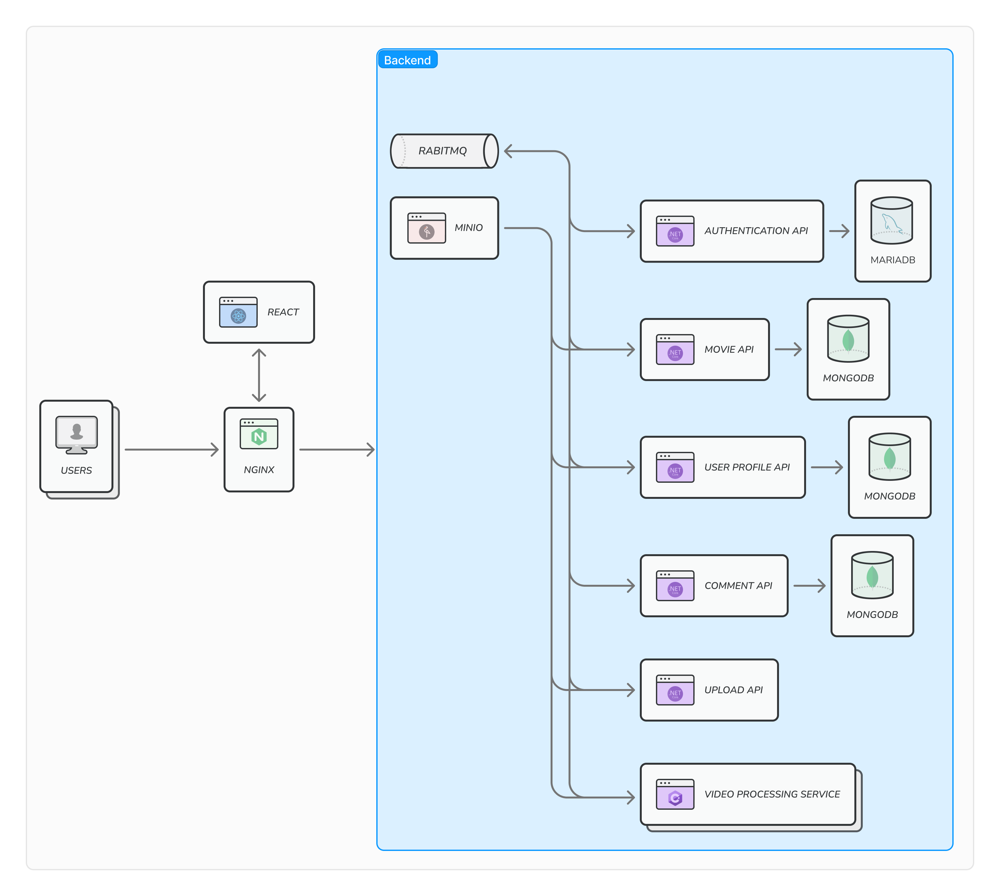

# Сервіс для перегляду фільмів Goose Hub

## Опис

Goose Hub - ваш унікальний космос розваг, де кожен користувач знаходить безліч можливостей для насолоди світом 
кіно та телевізійних шедеврів. 
Ми пропонуємо вам не просто переглядати фільми, але й повністю контролювати свій кінематографічний досвід. 
Зручний пошук дозволяє вам швидко знаходити саме те, що вас цікавить. 
Можливість висловлювати свої враження через коментарі та рейтинг додає вашій участі в кінотеатральному світі значущості. 
Авторизація відкриває доступ до особистого кабінету, де ви можете вести історію переглядів, створювати списки улюблених, 
переглянутих чи запланованих фільмів, а також ділитися ними з друзями. 
Розклад виходу серій завжди на вас чекає, допомагаючи не пропустити найочікуваніші моменти.
Goose Hub - де ваші емоції зберігаються в кожному кадрі.

## Use cases
- Перегляд фільмів, аніме, серіалів тощо;
- Можливість пошуку:
    - За назвою;
    - За жанром;
    - За роком випуску;
- Можливість писати та відповідати на коментарі;
- Можливість авторизації та реєстрації користувачів; 
- Особистий кабінет користувача:
    - Історія переглядів;
    - Історія коментарів;
    - Списки улюблене, переглянуті, у планах, кинуто і можливість створювати свої списки;
- Розклад виходу серій;
- Панель адміністратора:
    - Завантаження та автоматична обробка в 720p та 480p фільмів, нових серій, тощо;
    - Можливість редагувати інформацію про фільми;

## Архітектура

Сервіс побудовано за мікросервісною архітектурою.

## Репозиторії

- [Frontend](https://github.com/Navatusein/Goose-Hub-Frontend)
- [Authentication API](https://github.com/Navatusein/Goose-Hub-Authentication-API)
- [Movie API](https://github.com/Navatusein/Goose-Hub-Movie-API)
- [User Profile API](https://github.com/Navatusein/Goose-Hub-User-Profile-API)
- [Comment API](https://github.com/Navatusein/Goose-Hub-Comment-API)
- [Upload API](https://github.com/Navatusein/Goose-Hub-Upload-API)
- [Video Processing Service](https://github.com/Navatusein/Goose-Hub-Video-Processing-Service)